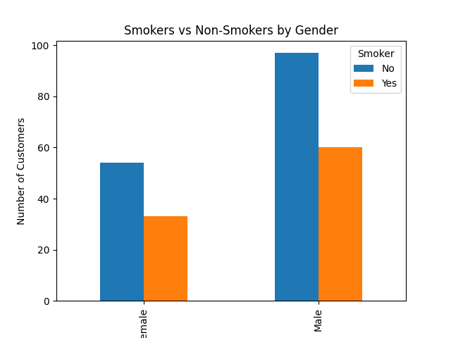

# smokers-vs-non-smokers-analysis
Data analysis of smokers vs non-smokers by gender using Python, Pandas, and Matplotlib.

# 📊 Smokers vs Non-Smokers Analysis

## Project Overview

This project explores the relationship between **gender and smoking habits** using the well-known `tips` dataset.

The goal of this project is to practice **data analysis and data visualization with Python**, using tools commonly used in data science such as **Pandas** and **Matplotlib**.

By analyzing this dataset, we can observe patterns in customer behavior and compare the number of smokers and non-smokers across different genders.

---

## Dataset

The dataset used in this project comes from the public dataset collection provided by Seaborn.

It contains information about restaurant customers, including:

- Total bill
- Tip amount
- Gender
- Smoking status
- Day of the week
- Time (Lunch/Dinner)
- Number of people at the table

Dataset source:  
https://github.com/mwaskom/seaborn-data

---

## Objective

The objective of this analysis is to:

- Explore the dataset using **Pandas**
- Group data by **gender and smoking status**
- Visualize the number of **smokers and non-smokers**
- Practice **basic exploratory data analysis (EDA)** techniques

---

## Technologies Used

This project was developed using:

- Python
- Pandas
- Matplotlib

---

## Data Analysis

The dataset was grouped by **gender** and **smoking status** to count how many customers belong to each category.

This allows us to compare:

- Male smokers vs male non-smokers
- Female smokers vs female non-smokers

The results are displayed using a **bar chart** to make the comparison easier to visualize.

---

## Visualization

The chart below shows the number of smokers and non-smokers by gender.

---

## Skills Demonstrated

This project demonstrates several fundamental data analysis skills:

- Loading datasets from a URL
- Data exploration using Pandas
- Data grouping and aggregation
- Data visualization using Matplotlib
- Basic data interpretation

---

## How to Run the Project

Install the required libraries:
